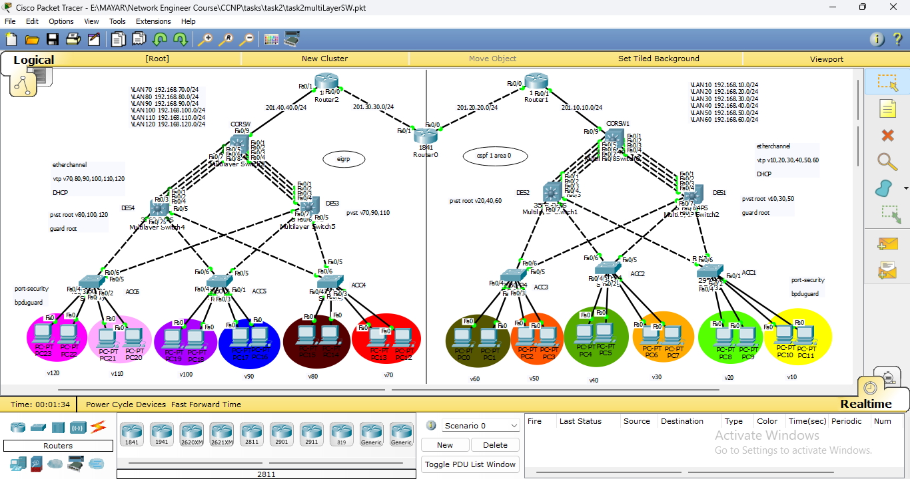
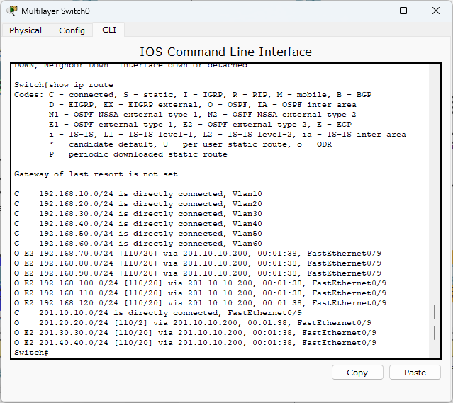

# Multilayer Switch & Redistribution Campus Project

A simple enterprise campus network project simulated in **Cisco Packet Tracer** demonstrating Layer 2 configuration, Layer 3 routing, and route redistribution.

---

## 📌 Network Topology & Overview

In this project, I built a multi-tier enterprise network topology divided into two main domains (OSPF on the right and EIGRP on the left). The design includes 3 Routers, 6 Multilayer Switches, and 6 Access Switches connected to multiple user PCs.

---

## 🚀 Configuration Steps

### 1. VLANs & Inter-VLAN Routing
* Created multiple VLANs (`VLAN 10-60` on the right side and `VLAN 70-120` on the left side).
* Configured Switched Virtual Interfaces (SVIs) on Multilayer Switches (`CORSW1` & `CORSW2`) for Inter-VLAN routing and set up DHCP services.

### 2. Switching & Layer 2 Security
* Configured **EtherChannel** bundles between switches for link aggregation and redundancy.
* Fine-tuned **PVST+** for load balancing across VLANs and enabled **Root Guard** for Spanning Tree protection.
* Applied **Port-Security** and **BPDU Guard** on Access Switch ports to block unauthorized connections.

### 3. Layer 3 Routing & Redistribution
* Configured **OSPF (Area 0)** on the right domain and **EIGRP** on the left domain.
* Used the middle router (`Router0`) as a **Border Router (ASBR)** to perform mutual route redistribution between OSPF and EIGRP, allowing both domains to communicate.

---

## 🔍 Verification & Routing Table

To verify full end-to-end connectivity, I checked the routing table on the core Multilayer Switch (`CORSW1`). As shown below, all subnets are reachable, with the remote EIGRP subnets successfully learned via OSPF as External Type 2 (`O E2`) routes.

---

## 📁 Repository Files

* You can download and test the full simulation file: `task2multiLayerSW.pkt`.
* All CLI commands and configurations used in this project are saved in: `configurations.txt`.

---

## 🛠️ Tools Used
* **Simulator:** Cisco Packet Tracer
* **Devices:** Cisco Multilayer Switches (3560), Access Switches (2960), and Routers.

